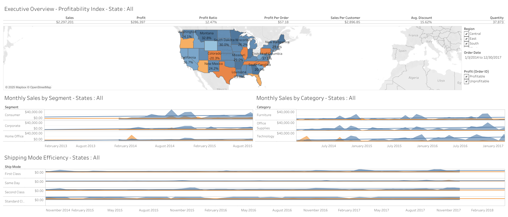

# 🛍️ Retail Sales Performance Dashboard 

## 📌 Overview
This Tableau project explores the sales, profit, discount, and shipping data from the Sample Superstore dataset—a fictional retail business dataset commonly used for data visualization practice. The goal is to extract actionable insights that can guide business decisions in retail operations, marketing, and logistics.

## 🧩 Dataset

- **Source**: [Tableau Sample Superstore Dataset](https://public.tableau.com/app/sample-data/sample_-_superstore.xls)
- **Type**: Retail transaction data
- **Features**:
  - Order ID, Date, Region, State
  - Product Category, Sub-Category
  - Sales, Profit, Quantity, Discount
  - Customer Segment
  - Shipping Mode

## 🎯 Business Questions Addressed

1. Which product categories and sub-categories are most and least profitable?
2. How does performance vary by category,shipping mode and segment?
3. What is the relationship between discounts and profitability?
4. How does the choice of shipping mode affect profit and delivery efficiency?
5. What are the sales and profit trends over time?

## 📊 Dashboard Highlights

- **Map: Profit Ratio by Geography**
- **Area Charts: Sales by Category,Sales by Shipping Mode and Sales by Segment**
- **Text Table: Key Performance Indicators**
- **Bar Chart: Profit Ratio by City**

## 🧠 Key Insights

- **Unprofitable Sub-Categories**: Furniture show increasing losses due to excessive discounting.
- **Regional Variance**: The West region dominates in total sales, but some states show declining profit margins.
- **Shipping Optimization**: Standard shipping mode outperforms others in terms of sales and profitability.
- **Discount Strategy**: High discount rates often reduce profit margins, except in Technology-related items.
- **Customer Segment Focus**: Consumer segment clients have higher profitability potential than Consumer segment.

## 🛠 Tools Used

- [Tableau Public](https://public.tableau.com/)

## 📷 Dashboard Previews

https://public.tableau.com/views/RetailSalesPerformance_17473803640410/Overview?:language=en-US&publish=yes&:sid=&:redirect=auth&:display_count=n&:origin=viz_share_link

## 📂 How to Explore

1. Download the dataset from the [official Tableau link](https://public.tableau.com/app/sample-data/sample_-_superstore.xls).
2. Open the `Retail Sales Performance.twbx` dashboard file in Tableau Public or Tableau Desktop.
3. Use filters and tooltips to explore insights interactively.

